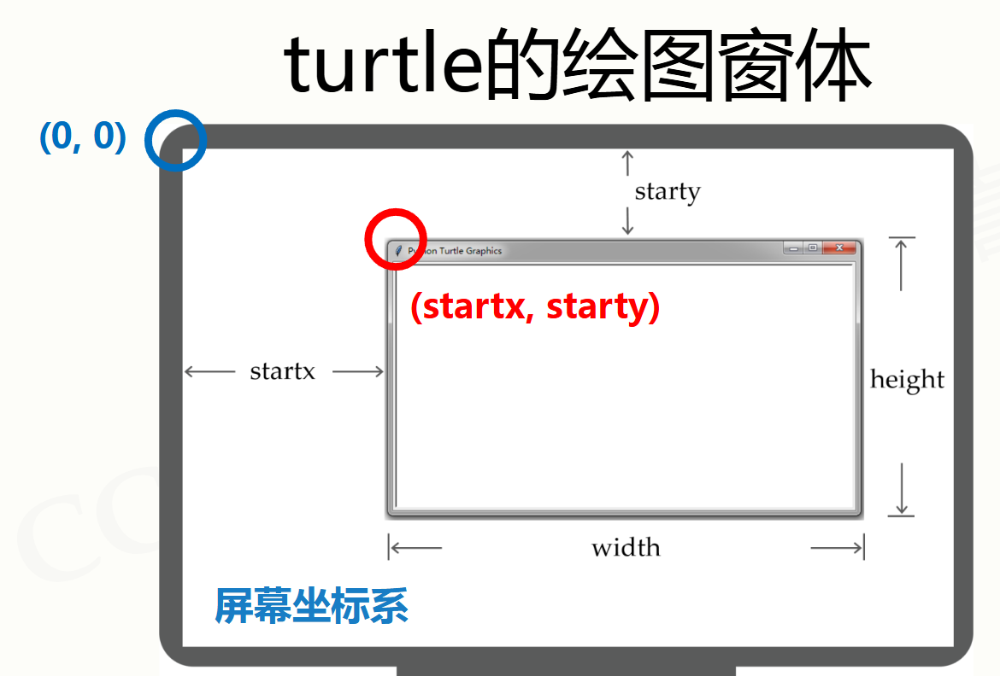
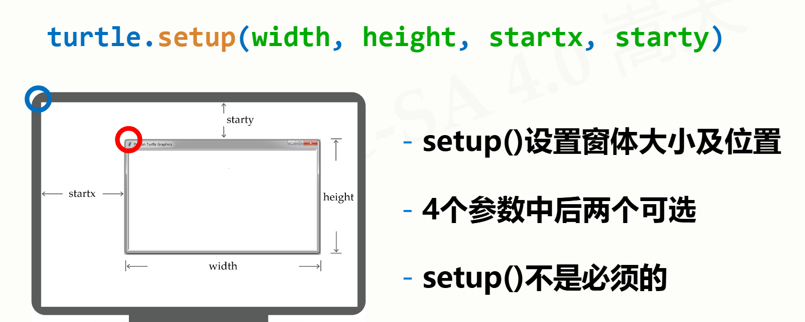
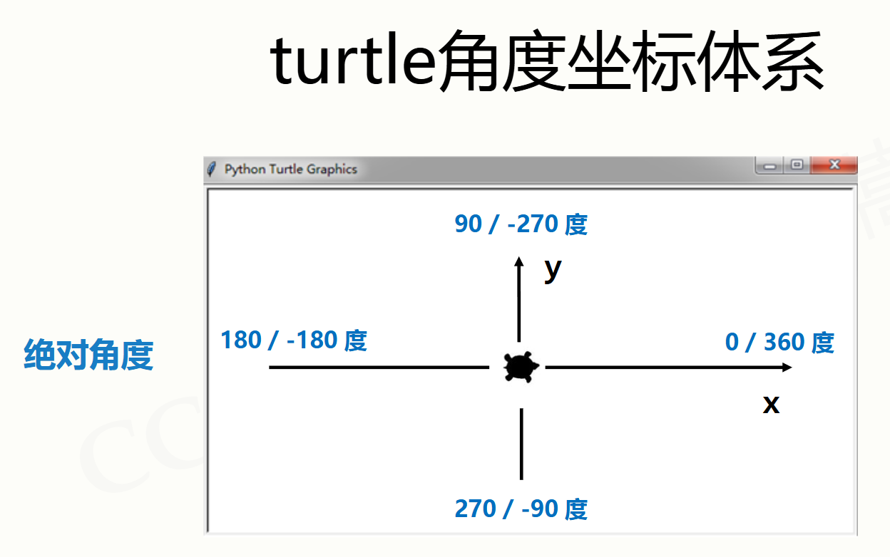
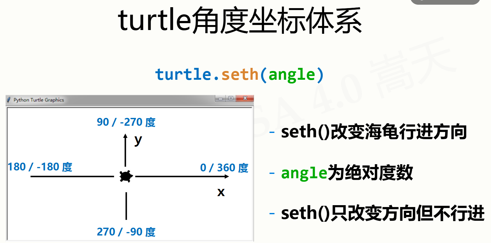
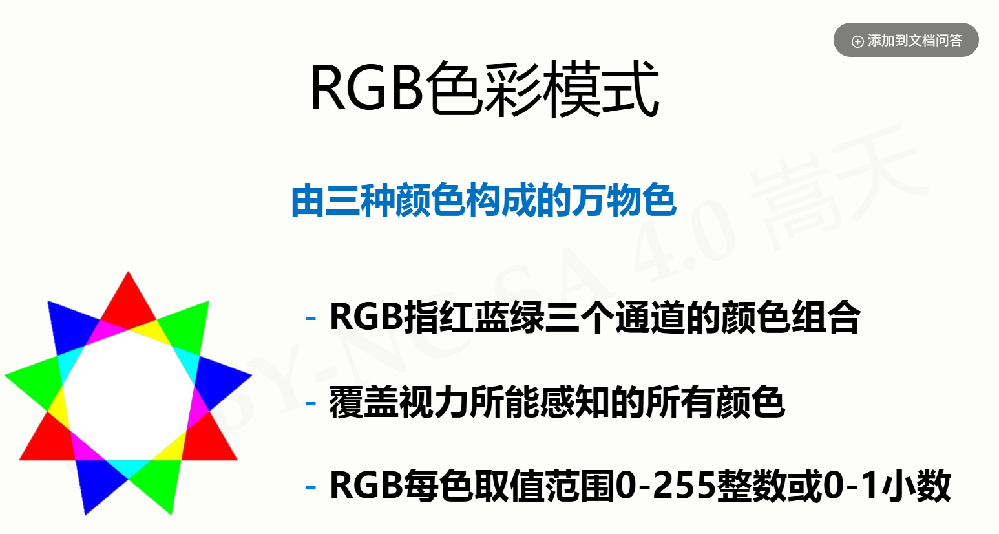
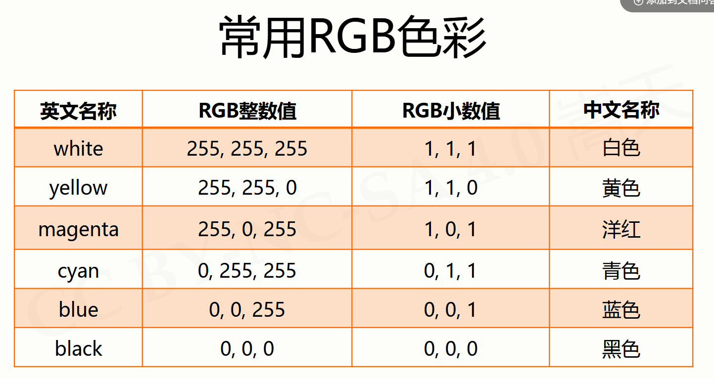
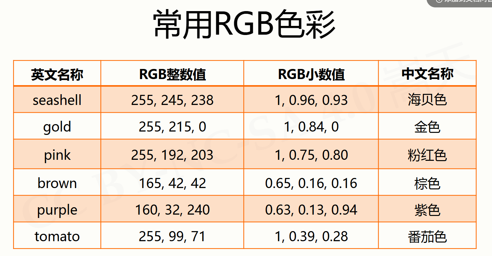

# turtle库

## turtle库基本介绍

Python计算生态=标准库+第三方库
库Library、包Package、模块Module，统称模块
海龟绘图原理就是海龟移动的轨迹

## turtle绘图窗体布局

turtle.setup设置宽度、高度、位置，后两个参数可选，左上角坐标为(0,0),省略为正中间

## turtle空间坐标体系

goto画直线，bk向后，fd向前
circle画圆

## turtle角度坐标体系

left向左，right向右

## RGB色彩体系

RGB色彩体系是一种通过红色（Red）、绿色（Green）、蓝色（Blue）三种颜色的不同组合来表示各种颜色的方法。每种颜色的取值范围通常为0-255。通过调整三种颜色的比例，可以混合出丰富的色彩。例如：

- 红色：`(255, 0, 0)`  `(1, 0, 0)`
- 绿色：`(0, 255, 0)`  `(0, 1, 0)`
- 蓝色：`(0, 0, 255)`  `(0, 0, 1)`
- 黄色：`(255, 255, 0)`  `(1, 1, 0)`
- 青色：`(0, 255, 255)`  `(0, 1, 1)`
- 品红：`(255, 0, 255)`  `(1, 0, 1)`
- 白色：`(255, 255, 255)`  `(1, 1, 1)`
- 黑色：`(0, 0, 0)`  `(0, 0, 0)`

在`turtle.colormode(1)`时，RGB颜色值范围为0~1。
默认是小数值，在turtle库中，可以使用`turtle.colormode(255)`设置颜色模式为RGB，然后通过`turtle.pencolor()`或`turtle.fillcolor()`设置颜色。
