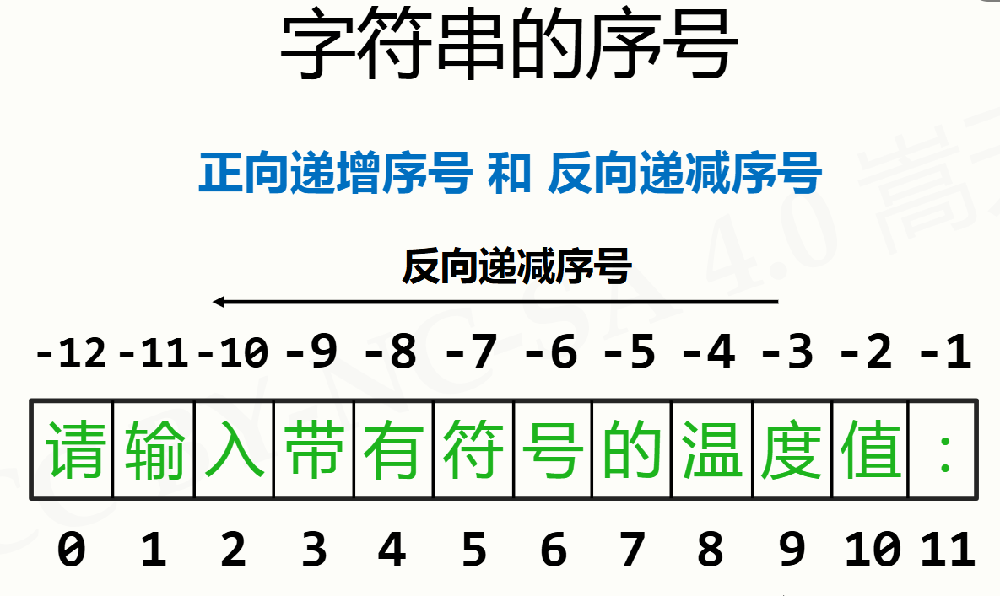
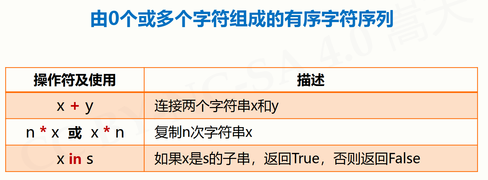
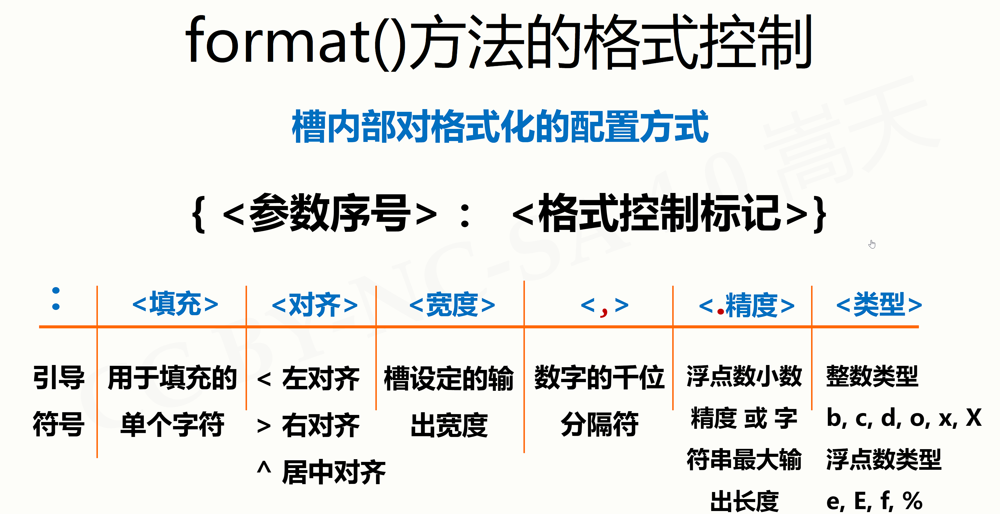

# 字符串类型及操作

## 字符串类型的表示

单双引号可表示单行字符串  
三单或三双引号可表示多行  

  
可根据此序号来切片  

## 字符串操作符

  
[WeekNamePrintV1.py](WeekNamePrintV1.py)  
[WeekNamePrintV2.py](WeekNamePrintV2.py)

## 字符串处理函数

len(X) 返回字符串X的长度  
str(x) 输出x的字符串形式  
hex(x) x的十六进制字符串形式  
oct(x) x的八进制字符串形式  
chr(u) x为Unicode编码，返回对应的字符  
ord(x) x为字符，返回对应的Unicode编码  
从0到1114111(0x10FFFF)空间，每个编码对应一个字符  
Python字符串中每个字符都是Unicode编码字符  
[UnicodeTest.py](UnicodeTest.py)

## 字符串处理方法

- `X.lower()`：将字符串X中的所有字母转换为小写  
- `X.upper()`：将字符串X中的所有字母转换为大写  
- `X.strip()`：去除字符串X两端的空白字符  
- `X.strip(chars)`：去除字符串X两端所有在chars中的字符，chars省略时默认去除空白字符  
- `X.replace(old, new)`：将字符串X中的old子串替换为new  
- `X.split(sep)`：以sep为分隔符将字符串X拆分为列表  
- `X.find(sub)`：查找子串sub在X中的首次出现位置，找不到返回-1  
- `X.count(sub)`：统计子串sub在X中出现的次数  
- `X.startswith(prefix)`：判断X是否以prefix开头  
- `X.endswith(suffix)`：判断X是否以suffix结尾  
- `X.join(list)`：用X作为分隔符，将列表list中的元素连接成一个字符串  
- `X.center(width, fillchar=' ')`：返回一个新字符串，使 X 居中，并用 fillchar（默认为空格）填充至指定宽度。若宽度小于等于原字符串长度，则返回原字符串。  

## 字符串类型的格式化

