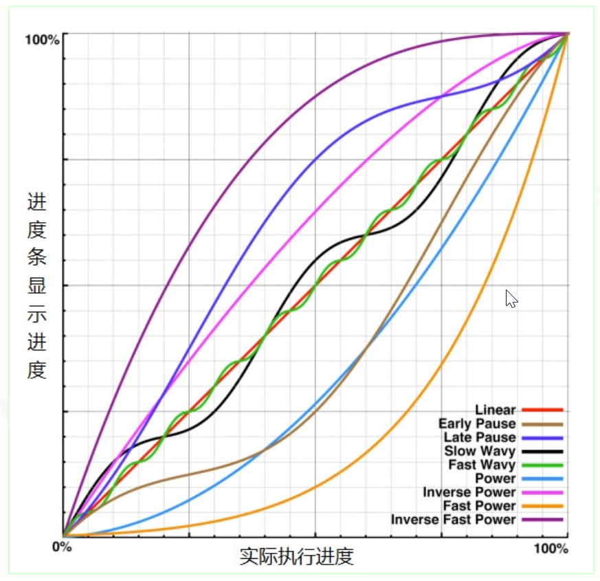
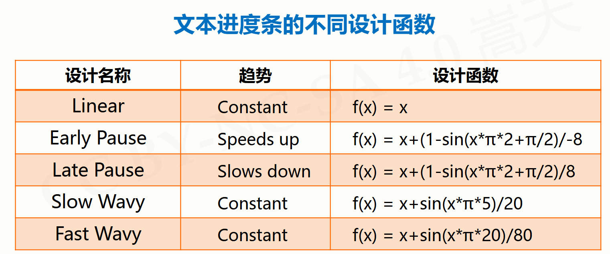
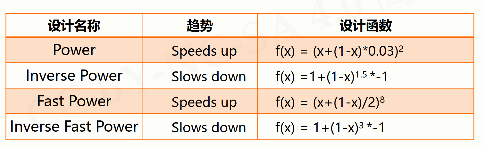

# time模块的使用

[Python 官方文档（中文）](https://docs.python.org/zh-cn/3/)  

## time标准库基本介绍

```python
import time
# 使用time模块中的函数
time.函数名()
```

计算机时间的表达  
提供获取系统时间并格式化输出功能  
提供系统级精确计时功能，用于程序性能分析  

时间获取：`time()` `ctime()` `gmtime()`  
时间格式化：`strftime()` `strptime()`  
程序计时：`sleep()` `perf_counter()`  

## 时间获取

```python
print(time.time())      # 当前时间戳，浮点数
print(time.ctime())     # 返回易读字符串形式
print(time.gmtime())    # 获取当前时间，表示为计算机可处理的时间格式
```

## 时间格式化

```python
tpl = "%Y-%m-%d %H:%M:%S"  # 定义时间格式模板
ts = time.gmtime()         # 获取当前UTC时间的struct_time对象
formatted_time = time.strftime(tpl, ts)  # 按模板格式化时间
print(formatted_time)      # 输出格式化后的时间字符串

ts = time.strptime(formatted_time, tpl)  # 将字符串解析为struct_time对象
print(ts)                  # 输出struct_time对象
```

## 程序计时应用

程序计时指测量起止动作所经历时间的过程  

- 测量时间：perfcounter()  
- 产生时间：sleep(s)  

## 文本进度条

  

  

  
