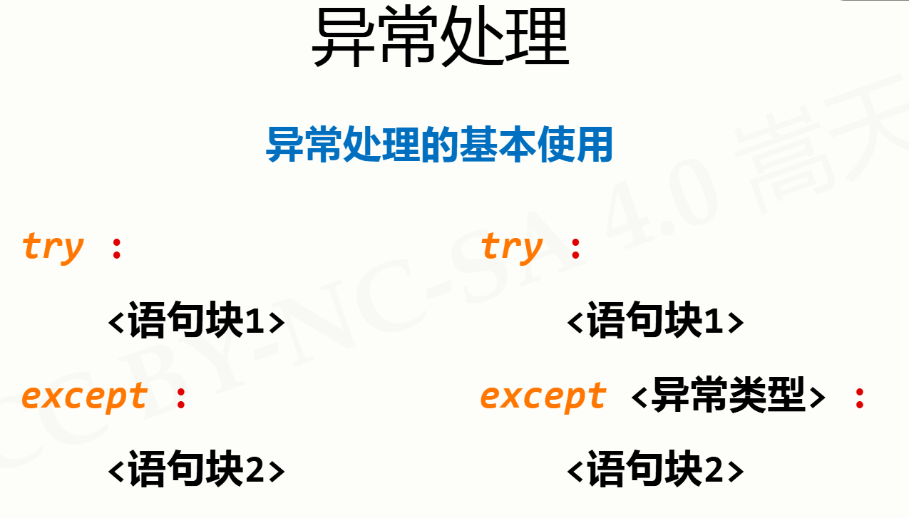

# 程序的分支结构

## 单分支结构

if <条件>:
    <语句块>

## 二分支结构

if <条件>:
    <语句块1>
else:
    <语句块2>

<表达式1> if <条件> else <表达式2>

## 多分支结构

if <条件1>:
    <语句块1>
elif <条件2>:
    <语句块2>
else:
    <语句块N>

## 条件判断及组合

and or not

## 程序的异常处理

