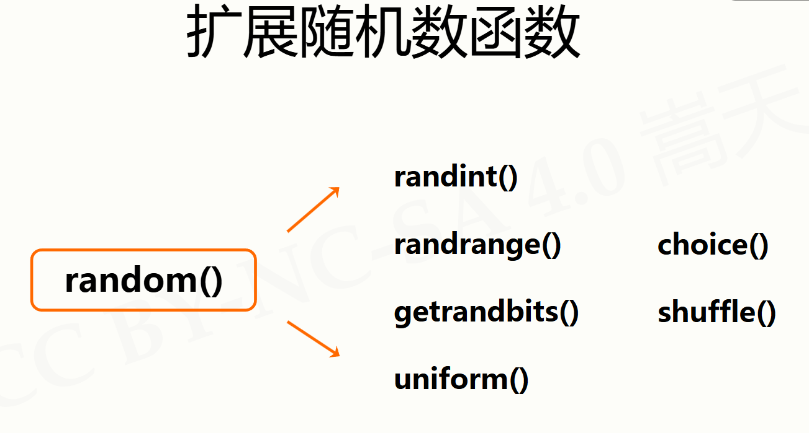

# 模块random库的使用

## random库基本介绍

random库是使用随机数的Python标准库。  
伪随机数：采用梅森旋转算法生成的（伪）随机序列中元素。  
random库主要用于生成随机数。

使用random库：

  ```python
  import random
  ```

random库包括两类函数，常用共8个  
基本随机数函数：  

  ```python
 seed(),random()  
  ```

扩展随机数函数：  

  ```python
randint(),getrandbits(),uniform(),  
randrange(),choice(),shuffle()  
  ```

## 基本随机函数

```python
#初始化给定的随机数种子，默认为当前系统时间
random.seed(n=None) 
#生成一个[0.0,1.0)之间的随机小数
random.random()
```

## 扩展随机函数



```python
# 生成[a, b]范围内的一个整数
random.randint(a, b)

# 生成[m, n)范围内，步长为k的一个整数
random.randrange(m, n[, k])

# 生成k位二进制的随机整数
random.getrandbits(k)
print(bin(random.getrandbits(k)))

# 生成[a, b]范围内的一个随机小数
random.uniform(a, b)

# 从序列seq中随机选取一个元素
random.choice(seq)

# 将序列seq中的元素随机排列（原地修改）
random.shuffle(seq)

```
